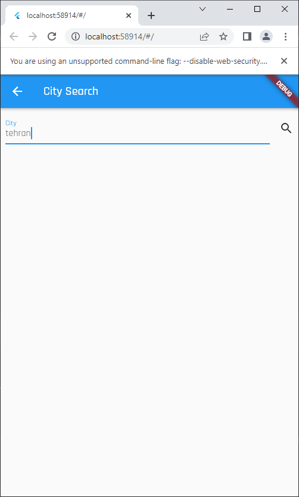
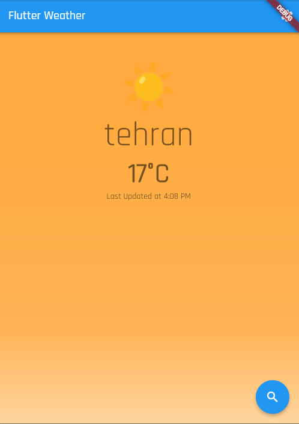
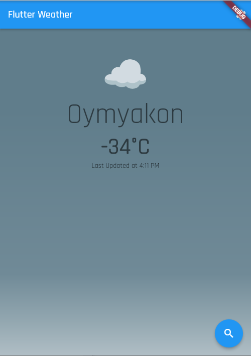
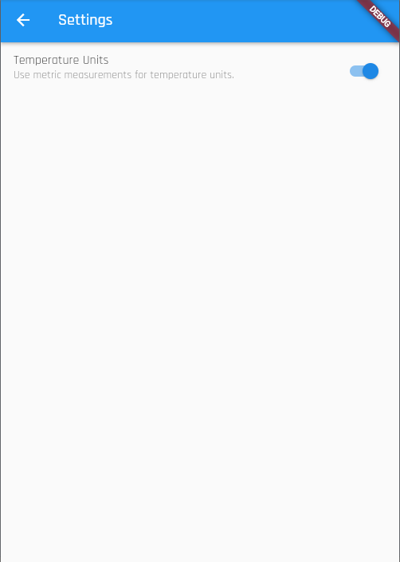
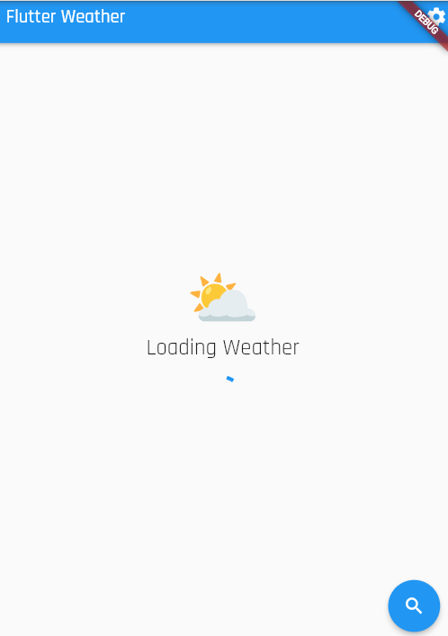
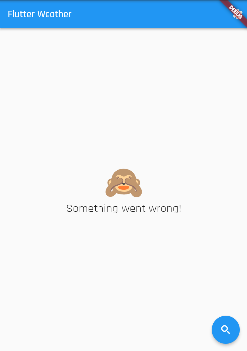

# Weather

A feature driven weather application with [open meteo api](https://open-meteo.com/en)

## Project structure
Our app will consist of isolated features in corresponding directories. This enables us to scale as the number of features increases and allows developers work on different features in parallel.
Our app can be broken down into four main features: search, settings, theme, weather.
```text
flutter_weather
|-- lib/
  |-- search/
  |-- settings/
  |-- theme/
  |-- weather/
  |-- main.dart
|-- test/
```

## Project Requirements
Our app should let users
* Search for a city on a dedicated search page
  
* See a pleasant depiction of the weather data returned by Open Meteo API
  A warm city                |  A cold city
  :-------------------------:|:-------------------------:
     |  

* Change the units displayed (metric vs imperial)
  

Application state should persist across sessions: i.e., the app should remember its state after closing and reopening it (using HydratedBloc)

## Architecture
* Data: retrieve raw weather data from the API
* Repository: abstract the data layer and expose domain models for the application to consume
* Business Logic: manage the state of each feature (unit information, city details, themes, etc.)
* Presentation: display weather information and collect input from users (settings page, search page etc.)
## Additional Screenshots
A warm city                |  A cold city
  :-------------------------:|:-------------------------:
   |  


## Getting Started

This project is a starting point for a Flutter application.

A few resources to get you started if this is your first Flutter project:

- [Lab: Write your first Flutter app](https://docs.flutter.dev/get-started/codelab)
- [Cookbook: Useful Flutter samples](https://docs.flutter.dev/cookbook)

For help getting started with Flutter development, view the
[online documentation](https://docs.flutter.dev/), which offers tutorials,
samples, guidance on mobile development, and a full API reference.
